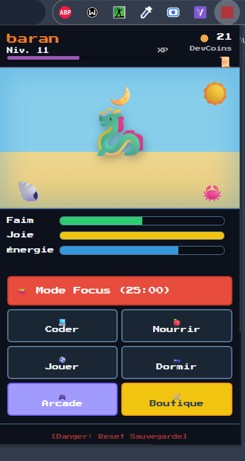

# NaviPet - Ton Compagnon Virtuel de Développement

NaviPet est une extension Chrome interactive sous la forme d'un petit animal de compagnie virtuel (façon Tamagotchi) qui vit dans ton navigateur. Prends soin de lui, joue à des mini-jeux, personnalise-le et reste concentré pendant tes sessions de code !
*(Transition majeure en cours: remplacement de tous les emojis par des pixel arts)*

## ✨ Fonctionnalités Principales

*   **Gestion Complète des Besoins :** Gère la Faim, la Joie et l'Énergie de ton compagnon. L'avancée et le vieillissement continuent même quand le navigateur est éteint grâce à une gestion de timestamps !
*   **Boutique & Inventaire Amélioré :** Dépense tes DevCoins gagnés pour acheter de la nourriture, débloquer des décors, ou équiper des accessoires sur ton pet. 
*   **Salle d'Arcade :** Gagne de l'argent en jouant :
    *   *Chasse aux Bugs :* Écrase un max de bugs avant la fin du temps imparti (15s) !
    *   *Memory :* Retrouve toutes les paires avant la fin du timer (45s).
    *   *Saut d'Obstacles :* Un mini-jeu type "Dino Chrome" où tu dois esquiver des cactus pour gagner des points !
    *   *Pierre-Feuille-Ciseaux :* Défie directement ton familier en duel (Attention, ça lui coûte de l'énergie).
*   **Notifications Configurables :** Choisis d'activer ou désactiver les alertes directement dans l'extension via le bouton "cloche" (utilise les API optionnelles de Chrome pour le respect de la vie privée).
*   **Mode Focus (Pomodoro) :** Lance un minuteur de concentration pour travailler sans distraction. Pendant ce temps, ton compagnon gagne de l'XP et accumule des paliers !
*   **Quêtes Journalières :** Complète des objectifs spécifiques chaque jour (Reset automatique à minuit) pour gagner de belles récompenses (XP, Coins).
*   **Nettoyage & Propreté :** Au fil du temps, des saletés (taches) apparaissent dans la pièce de ton compagnon. Garde le clic enfoncé sur les taches pour nettoyer sa zone et gagner des DevCoins aléatoires ! Attention, si tu laisses la pièce devenir trop sale, ton familier commencera à se plaindre et sa jauge de Joie descendra rapidement.
*   **Cycle Jour / Nuit :** Thème de l'interface dynamique qui change selon ton heure locale.

## 🏗️ Architecture Technique (Clean Code)

Le projet a été pensé avec des standards de développement modernes et de l'ingénierie logicielle avancée :

*   **Manifest V3 :** Standard actuel de Google (utilisation de `chrome.storage.local`, listes de permissions strictes).
*   **Architecture Modulaire (ES6) :** Structure décomposée en modules par domaine métier (`state.js`, `ui.js`, `shop.js`, `minigames.js`, `quests.js`) pour une grande maintenabilité.
*   **State Management (Pattern Pub/Sub) :** Un gestionnaire d'état (`PetState`) agit comme un Store réactif. Il notifie les UIs abonnées à chaque modification pour rafraîchir l'écran, et se synchronise automatiquement en local.
*   **Event-Driven Architecture :** L'émission d'évènements Customisés (`navipet:action`) désapparie les modules. Les quêtes écoutent le système entier sans que l'on ait à forcer des dépendances directes de partout !
*   **Séparation des responsabilités (CSS/HTML) :** Feuilles de style isolées, sans code spaghetti.

## 🚀 Comment installer l'extension (Mode Développeur)

NaviPet s'installe localement sur n'importe quel navigateur basé sur Chromium (Chrome, Brave, Edge...) en 4 étapes simples :

1.  **Cloner le dépôt** (ou télécharger en .zip) sur ton ordinateur.
2.  **Ouvrir la page des extensions :** Tape `chrome://extensions/` dans la barre d'adresse de ton navigateur.
3.  **Activer le Mode Développeur :** En haut à droite de ta page, bascule l'interrupteur.
4.  **Charger l'extension non empaquetée :** Clique sur le bouton "Charger l'extension non empaquetée" et sélectionne le dossier racine `NaviPet-extension`.

## 🛠️ Comment développer ?

Pour modifier le code :
1. Fais tes modifications dans les fichiers.
2. Ferme et rouvre la popup de l'extension pour voir les changements de l'UI en direct.
3. *Note :* Si tu modifies le `manifest.json`, pense à bien recharger l'extension via la page Web `chrome://extensions/` (icône petite flèche qui tourne circulaire).

## Crédits & Ressources
* **Palette de Couleurs :** [Endesga 32](https://lospec.com/palette-list/endesga-32) par ENDESGA. Utilisée sous licence libre pour unifier l'identité graphique du jeu et des sprites.